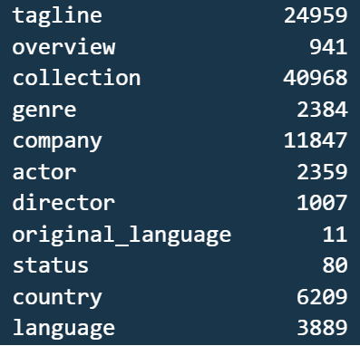

#  Proyecto Individual 1 - Machine Learning Operations

En este primer proyecto implementamos un Sistema de Recomendación de Películas. El mismo consta de 3 Fases: Transformaciones de los datos suministrados, Análisis Exploratorio de Datos (EDA) y Machine Learning (ML).

**Importante: Nos fue suministrado dos fuentes de datos en formato .csv: **_movies_dataset.csv_** y **_credits.csv_**. Dado que el archivo credits.csv es un archivo demasiado pesado, se tomó la decisión de convertirlo a formato .parquet, y así evitar inconvenientes a la hora de subirlo al repositorio de Github.**
#
#  Fase 1 - Transformaciones (ETL)

El Proceso ETL se encuentra en el archivo **etl.ipynb**. [link](etl.ipynb)

Los set de datos a utilizar se encuentra en los archivos **movies_dataset.csv**. [link](datasets/movies_dataset.csv) y **credits.parquet**. [link](datasets/credits.parquet)

## Extracción de Datos

 - Importamos las librerías necesarias: Pandas, Numpy, Re y Unicodedata, Pyarrow.
 - Accedemos a los datos de los archivos **_movies_dataset.csv_** y **_credits.parquet_**. 
 - Probamos que cada DataFrame se importara correctamente utilizando el método **.head()**.
 - Revisamos el tipo de datos de las variables y número de observaciones:
 
 	**moviesDf**: 45466  Observaciones, 24 Variables (4 numéricas y 20 categóricas).
 	 	
	**creditsDf**: 45476 Observaciones, 3 Variables (1 numérica y dos categóricas).

## Transformación de Datos

 - Desanidamos columnas:
 - Extraemos (Desanidamos) del DataFrame **moviesDf** los datos de las columnas: **belongs_to_collection, genres, production_companies, production_countries, spoken_languages**, que se encuentran en formato de listas de diccionarios para poder agregarlos al dataset de forma separada (nuevas columnas). Adicionalmente extraer los datos de las columnas: **cast, crew del DataFrame creditsDf**, y aplicar las funciones correspondientes **(extract_concatenate_name, extract_concatenate_director_name)**.
 - Eliminamos las columnas tratadas en el paso anterior, ya que se crearon nuevas columnas con el contenido generado por las funciones: **collection, genre, company, country, language, actor y director**.
 - Reemplazamos valores nulos de los campos **revenue y budget**. Para ello utilizamos el método **.fillna(0,  inplace=True)** el cual reemplaza los valores NA/NaN por 0 (Ceros).
 - Eliminamos valores nulos del campo **release_date**. Para ello damos formato a todos los valores de la columna utilizando la función de Pandas **pd.to_datetime(moviesDf['release_date'],  errors='coerce')**. Aquellos valores que no se les puede dar formato se les asigna **NaT (Not a Time)**. Luego utilizamos el método **.dropna(subset  =  ['release_date'],  inplace=True)** para eliminar los valores nulos (NaT).
 - Creamos la columna **release_year**. En este caso damos formato AAAA-MM-DD a la columna con la función **pd.to_datetime(moviesDf['release_date']).dt.strftime('%Y-%m-%d')**, luego con la propiedad **.dt.year** extraemos el año y lo asignamos a la variable **release_year**.
 - Creamos la columna **return**, y le asignamos como valor el calculo entre **revenue / budget**. Los valores nulos e infinitos los reemplazamos por 0 (Ceros).
 - Eliminar las columnas **video, imdb_id, adult, original_title, poster_path y homepage**. Utilizamos el método **.drop(columns=['video',  'imdb_id',  'adult',  'original_title',  'poster_path',  'homepage'],  inplace  =  True)**.
 
## Transformaciones Adicionales

Los datasets **movies_dataset.csv** y **credits.parquet**, se encuentran relacionados mediante la variable **id** la cual corresponde al identificador de la película. **credits.parquet** contienes los actores y directores de las películas, por este motivo deben unirse, y de esta forma trabajar con una sola fuente de datos.

 - Cambiamos el tipo de datos de las columnas **id**, y **vote_count** a int64.
 - Reemplazamos los valores nulos de la columna **runtime**, y luego cambiamos el tipo de datos a int64.
 - Creamos las columnas **release_month y release_day**, las cuales contendrán los meses y días en español de la columna **release_date**,  con la ayuda de las propiedades **.dt.month_name('es_ES')** y **.dt.day_name('es_ES')**.
 - Eliminar los acentos de la columna **release_day** aplicando la función **strip_accents**.
 - Consultamos los registros duplicados por cada DataFrame:
 
		|	moviesDF	| 	13 Observaciones Duplicadas
	 	
		|	creditsDF	| 	43 Observaciones Duplicadas
		
 - Eliminamos los duplicados de ambos DataFrame, dando como resultado:

		|	moviesDF	|	45363 Observaciones
	 	
		|	creditsDF	| 	45433 Observaciones

 - Consultamos los registros duplicados por **id** de cada DataFrame:
 
 		|	moviesDF	|	17 Observaciones Duplicadas
	 	
		|	creditsDF	|	 1 Observaciones Duplicadas

 - Eliminamos los duplicados por **id** de ambos DataFrame, dando como resultado:
 
	 	|	moviesDF	|	45346 Observaciones
	 	
		|	creditsDF	|	45432 Observaciones
		
- Hacemos merge entre los dos DataFrames:
**pd.merge(moviesDf,  creditsDf,  on='id',  how='left')**
- Damos formato a las variables categóricas con el metodo **.str.lower()**, para convertir el contenido en minúsculas: **title, tagline, overview, collection, genre, company, original_language, status, country, language, release_month, release_day, actor, director**, 

## Carga de Datos

 - Organizamos las columnas del DataFrame: 
**moviesCreditsDf[['id','title','tagline','overview','collection','genre','company','actor','director','original_language','status','country','language','runtime','popularity','vote_count','vote_average','release_date','release_month','release_day','release_year','revenue','budget','return']]**
 - Exportamos a un archivo .csv, el cual será la fuente de datos de entrada para la Fase 2 del proyecto;
 **moviesCreditsDf.to_csv('datasets/etl.csv',  index=False,  header=True,  sep=';',  encoding='utf-8')**
 
	> Contenido del Dataset ETL.csv: 45346 Observaciones, 24 variables (8 numéricas y 16 categóricas).
#
# Fase 2 -  Análisis Exploratorio de Datos (EDA)

El Análisis Exploratorio de Datos o en inglés Exploratory Data Analysis (EDA) es un método de análisis de los conjuntos de datos para resumir sus principales características. El EDA se utiliza para ver lo que los datos pueden decirnos antes de la tarea de modelación.

El Proceso EDA se encuentra en el archivo **eda.ipynb**. [link](eda.ipynb)
#
# Importar librerías y dataset

 - Importamos las librerías a utilizar: Pandas, Numpy, Missingno (librería para tratamiento de datos nulos), Matplotlib, Seaborn (librerías para graficar), wordcloud, Image.
 - Cargamos el dataset: **etl.csv**. [link](datasets/etl.csv)
#
# Determinamos el tamaño de los datos

- ¿Cuántas observaciones existen?  **45346 observaciones**

- ¿Cuántas variables hay?  **24 variables**

- ¿Cuántas variables categóricas existen?  **15 variables catecategóricas**

- ¿Cuántas variables continuas existen? **9 variables continuas**
#
#  Limpieza y validación de datos

-  ¿Existen valores faltantes?

-  ¿Cuál es la proporción de datos faltantes?

#
###  - Mostramos una matriz de calor para visualizar las variables con mayor presencia de valores nulos. Las líneas blancas indican los valores faltantes en cada columna.

-  ¿Cómo tratamos a los datos faltantes?

 1 - Eliminamos las columnas **collection** y **tagline**, ya que las mismas tienen mas  de 50% de datos nulos.
 
 2 - También eliminamos las columnas **id, original_language,  status,  country,  language**, ya que no las utilizaremos.
 
 3 - Eliminamos los valores nulos del dataframe.
 
 > Contenido del dataframe: 32095 Observaciones, 17 variables (8 numéricas y 9 categóricas).

4 - Eliminamos las observaciones que poseen valor 0 en **budget** y **revenue**, ya que ambas representan un valor sensible, el cual no se podría estimar o imputar. Cabe destacar que una película necesita un presupuesto y el monto recaudado una vez estrenada.
 > Filas con valores cero en la columna budget: 24054 observaciones,
 > Filas con valores cero en la columna revenue: 25160 observaciones,

5 - Exportamos a un archivo .csv, el cual será la fuente de datos de entrada para la Fase 3 del proyecto:
 **moviesDf.to_csv('datasets/movies.csv',  index=False,  header=True,  sep=';',  encoding='utf-8')**
 
 > Contenido Final del dataframe: 5166 Observaciones, 17 variables (8 numéricas y 9 categóricas).

#
# Análisis Univariado 

Analizamos cada variable por separado, dando respuesta a las preguntas planteadas:

1. ¿En qué año se estrenó la mayor cantidad de películas?

	**En el año 2016 y 2011 se estrenaron el mayor número  de peliculas (229 en total).**

#
2. ¿Qué género es el más frecuente?

	**EL género más frecuente en el conjunto de datos es el Drama**
	

#
3.- ¿Cuál es la compañía con mayor número de películas?
	**La compañía Warner Bros produjo el mayor número de películas (416).**

#
4.- ¿Cuál es el actor con mayor número de películas?
	**El Actor Samuel L. Jackson participó en el mayor número de películas (71).**

#
5.- ¿Cuál es el director con mayor número de películas?
	**El Director Steven Spielberg produjo el mayor número de películas (30).**

#
6.  ¿Cuál es la calificación promedio según los votos?
**La mayoría de las películas están clasificadas en el rango de 6-7.**

#
7.  ¿Cuál es el promedio de duración de las películas?
**La mayoría de las películas se encuentran en un rango de tiempo de duración de 90-110 minutos.**

#
## Análisis Multivariado

Analizar el efecto simultáneo de múltiples variables.

1. ¿Cuál es la correlación entre las variables?

-  Existe una fuerte correlación entre budget (presupuesto) y revenue (ingresos). Los ingresos aumentan ligeramente a niveles más altos, pero el número de películas con presupuestos elevados parece escaso. Existe una buena posibilidad de que las películas con mayores inversiones generen mejores ingresos.
-  Los ingresos parecen estar aumentando con la popularidad. Podemos decir que si la popularidad de la película es alta, los ingresos de la película pueden ser altos.
-  El público ha votado por películas con alto tiempo de ejecución.
-  Los votos, la popularidad, los ingresos y el presupuesto tienen una correlación directa entre sí, aunque en diferentes proporciones.
#
2. ¿Cuáles películas obtuvieron mayores ingresos  en el 2016 y 2011?

** En el 2016 el top 5 de películas con mayores ingresos fueron: captain america: civil war, rogue one: a star wars story, finding dory,  zootopia,the jungle book. Los géneros adventure y family fueron los mas comunes, así como también walt disney pictures aparece como compañía productora.**

**En el 2011 el top 5 de películas con mayores ingresos fueron: harry potter and the deathly hallows: part 2, transformers: dark of the moon, pirates of the caribbean: on stranger tides, the twilight saga: breaking dawn - part 1, mission: impossible - ghost protocol. Los géneros adventure y fantasy fueron los mas comunes, así como también paramount pictures aparece como compañía productora.**
#
3. ¿Cuáles películas obtuvieron mayores ingresos?

**El top 5 de películas con mayores ingresos fueron: avatar, star wars: the force awakens, titanic, the avengers y jurassic world.**
#
4. ¿Cuáles películas obtuvieron mayores presupuestos?

**El top 5 de películas con mayores presupuestos fueron: pirates of the caribbean: on stranger tides, pirates of the caribbean: at world's end, avengers: age of ultron, superman returns y tangled.**
#
5. ¿Cuáles películas han sido las mas populares?

**El top 5 de películas con mayor popularidad fueron: minions, wonder woman, beauty and the beast, baby driver, y big hero 6.**
#
6. ¿Cuál es el número de películas que se estrenaron por mes?.

**Septiembre es el mes con mayor estrenos de películas (596), seguido del mes de Diciembre (545).**
#
## Generamos una nube de palabras
-  Cada palabra de esta nube tiene un tamaño de fuente y un tono de color variables. Por lo tanto, esta representación ayuda a determinar las palabras destacadas de los títulos de las películas . Un tamaño de fuente más grande de una palabra retrata su prominencia más en relación con otras palabras en el grupo.

**Podemos visualizar que las palabras: man, day, love, night, girl, dead, tienen mayor prominencia en nuestra nube de datos.**
#
# Fase 3 -  Machine Learning (ML)

El modelo ML se encuentra en el archivo **ml.ipynb**. [link](ml.ipynb)

El set de datos a utilizar se encuentra en el archivo **movies.csv**. [link](datasets/movies.csv)

### Modelado 

- Para nuestro Sistema de Recomendacion utilizamos los filtros basados en contenido (contend-based filtering) como base de la prediccion, es decir, que sugiere películas similares basados en una películas en particular.

- En este sistema, las caracteristicas de las películas (overview, genre, company, actor) se usan para encontrar su similitud con otras películas. Luego se recomiendan 5 películas que tienen más probabilidades de ser similares a la consultada en nuestra API.

- El procesamiento del lenguaje natural (NLP) es un proceso de manipulación o comprensión del texto por cualquier software o máquina.

- Utilizamos La biblioteca NLTK (Natural Language Toolkit), la cual es una suite que contiene bibliotecas para el procesamiento estadístico del lenguaje, y de esta forma hacer que las máquinas entiendan el lenguaje humano y respondan con una respuesta adecuada.

- También utilizamos RAKE, el cual es un algoritmo de extracción de palabras clave en un cuerpo de texto mediante el análisis de la frecuencia de aparición de palabras y su co-ocurrencia con otras palabras en el texto.

- Utilizamos el Stemming, es una técnica de normalización de texto en el procesamiento del lenguaje natural. Esta técnica es ampliamente utilizadas para el preprocesamiento de texto. Es una técnica en la que un conjunto de palabras en una oración se convierten en una secuencia para acortar su búsqueda. En este método, se normalizan las palabras que tienen el mismo significado pero tienen algunas variaciones según el contexto o la oración.

-  Para nuestro modelo utilizamos la técnica k-Nearest Neighbor (**Knn**), mejor conocido como el método de vecinos más cercanos, para definir las recomendaciones, es un método de clasificación no paramétrico, la cual determina cuán similares son los objetos de datos independientemente de su tamaño.

-  Para calcular los (**Knn**), necesitamos el número de palabras de cada observacion de la columna 'tags'. Para realizar estos cálculos utilizamos CountVectorizer de Sklearn para aprender el vocabulario del conjunto de textos y luego transformarlos en un marco de datos que utilizamos para construir el modelo. Este proceso nos da como salida una matriz de correlaciones, luego define una matriz de distancia por medio de la matriz de correlaciones, y se aplica el método Knn, el cual realizará  la estimación.

-  Para calcular los (**Knn**), necesitamos el número de palabras de cada observacion de la columna 'tags'. Para realizar estos cálculos utilizamos CountVectorizer de Sklearn para aprender el vocabulario del conjunto de textos y luego transformarlos en un marco de datos que utilizamos para construir el modelo. Este proceso nos da como salida una matriz de correlaciones, luego define una matriz de distancia por medio de la matriz de correlaciones, y se aplica el método Knn, el cual realizará  la estimación.

-  Adicionalmente creamos una serie con los índices de cada una de de las películas , la cual utilizaremos en nuestra estimacion.

-  En nuestra función de recomendación, pasamos como parámetros el titulo de la películas que deseamos consular. Se realiza la búsqueda del titulo en el archivo de índices, el índice de la misma es buscado por (**Knn**), se obtiene una matriz la cual permite conocer cuales son las películas con mayor probabilidad para poder recomendarlas al usuario. La última línea muestra las 5 películas con mayor probabilidad de recomendar al usuario 1. Si la película no se encuentra en el set de datos, retorna una notificación.

#
#  API
## Despliege en Render https://movies-api-b38w.onrender.com/docs

Nuestros endpoints se encuentran en el archivo **main.py**. [link](main.py)

- RootLos set de datos a utilizar se encuentra en los archivos **movies.csv**. [link](datasets/movies.csv) y **moviesML.csv**. [link](datasets/movies.csv)

	**@app.get('/')**

- Retorna la cantidad de películas por un mes en específico.

	**@app.get('/cantidad_filmaciones_mes/{mes}')**

- Retorna la cantidad de películas por un día en específico.

	**@app.get('/cantidad_filmaciones_dia/{dia}')**

- Retorna el titulo, añoy popularidad de una película específica.

	**@app.get('/score_titulo/{titulo}')**

- Retorna el titulo, año, voto total y voto promedio de una película con votos mayores a 2000.

	**@app.get("/votos_titulo/{titulo}")**

- Retorna el nombre del actor, cantidad de películas, retorno total y retorno promedio.

	**@app.get("/get_actor/{nombre_actor}")**

- Retorna el nombre del director, retorno total del director, películas del director (titulo, año, retorno, budget y revenue de cada película).

	**@app.get("/get_director/{nombre_director}")**

- Sistema de Recomendación. Retorna las 5 películas mas parecidas.

	**@app.get("/recomendacion/{titulo}")**